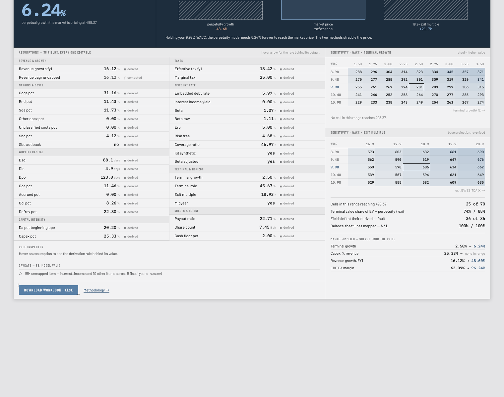
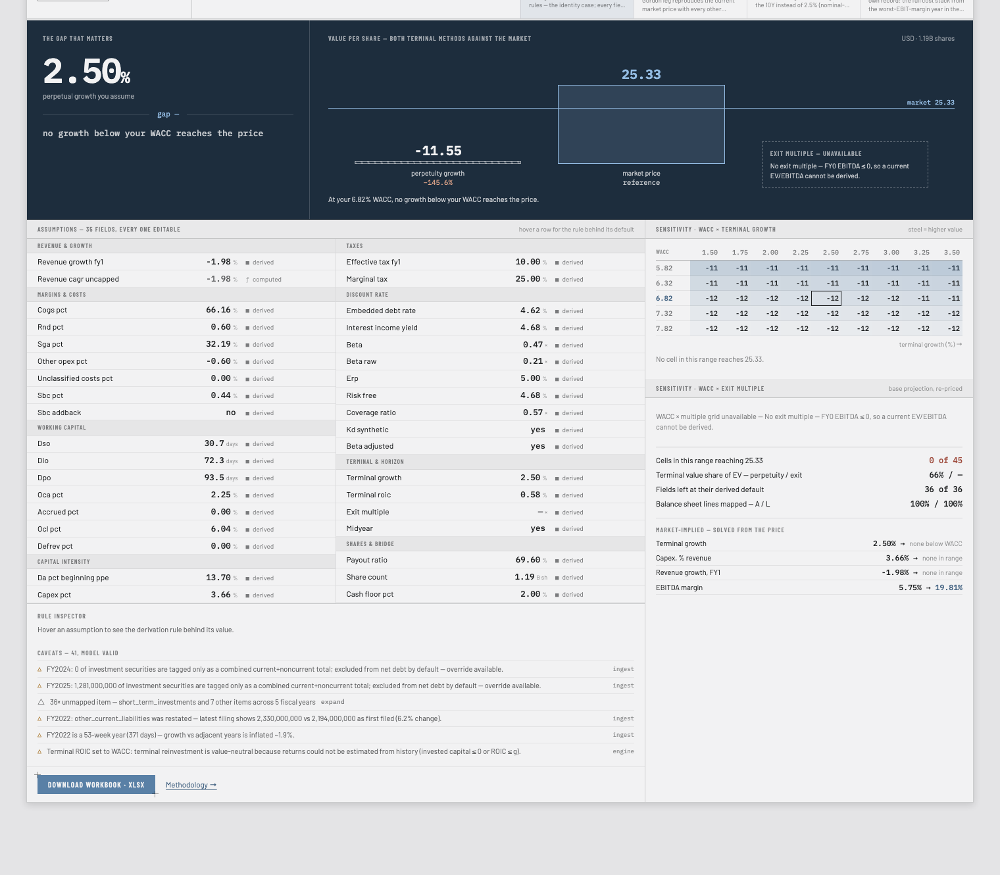

# Ticker to Model

Enter a US public-company ticker → get an editable set of financial assumptions, a DCF
valuation dashboard, and a downloadable Excel workbook containing a full three-statement
model with **live formulas** — click FY2029 EBITDA and see a formula referencing other
cells, not a pasted number.



The project was built to survive two hostile reviews: a finance-literate reader who
opens the workbook and clicks into cells, and an engineer who reads this repo. Every
claim below is backed by a test you can run.

## The five things that are non-negotiable

1. **The exported workbook is formula-driven.** Inputs, calculations, and outputs are
   structurally separated; every assumption is a named range; no circular references,
   no macros, no iterative calculation. It recalculates in Excel, Google Sheets, and
   LibreOffice.
2. **Every assumption is derived, documented, and editable.** Defaults come from the
   company's own filed history via stated derivation rules ("3-year revenue CAGR,
   capped at 30%"), and every value carries provenance — derived, preset, or yours.
3. **Validation is a feature.** The balance sheet must balance, cash flow must tie to
   the change in cash, net income must agree across statements — live check cells in
   the workbook, loud states in the UI. A model that doesn't tie is refused, not shipped.
4. **Degradation is graceful.** Live EDGAR → SQLite cache → committed snapshot, and a
   company the pipeline can't model honestly (banks, extension-tag filers, coverage
   below the gate) gets a reasoned refusal, never garbage.
5. **The methodology is public.** Every convention — SBC treatment, beta window,
   terminal reinvestment, WACC weights, all of it — renders from one file
   ([`backend/engine/methodology.yaml`](backend/engine/methodology.yaml)) onto the
   website's `/methodology` page *and* the workbook's Methodology sheet, so the
   documentation cannot drift from the model.

## The test that makes the workbook trustworthy

The Python engine is the single source of truth for every number. The CI gate
generates a workbook, **recalculates it headlessly in LibreOffice, and diffs every
output cell — valuation, statements, and each individually re-projected sensitivity
cell — against the engine** (relative tolerance 1e-6). A second gate edits input
cells, recalculates, and asserts outputs moved by the engine-predicted amount, proving
the formulas are live, not cached. If the writer and the engine ever disagree, the
build fails.

## Honesty as a design principle

Companies that can't be modeled credibly say so, with the reason:



Kraft Heinz above: a negative perpetuity value printed as-is (EV below gross debt is a
legitimate statement at those assumptions, not a bug), an exit-multiple leg that
declines to exist (trailing EBITDA ≤ 0) with its reason on a plate, reverse-DCF solves
that report "no growth below your WACC reaches the price," a filer restatement and a
53-week year surfaced as caveats. Nothing is silently defaulted to zero anywhere in
the pipeline; what breaks, and why, is catalogued in
[`docs/known-limitations.md`](docs/known-limitations.md) — kept current on purpose.

## How it works

```
ticker ─► ingest (EDGAR companyfacts ─ schema.yaml tag chains ─ validation)
             │ FinancialHistory
             ▼
          engine (derived assumptions ─ projections ─ FCF ─ WACC ─ DCF ─ reverse DCF)
             │ ▲ MarketInputs (price, beta, 10Y) from market/
             │ ModelResult
             ├────────► excel writer ─► .xlsx (live formulas + named ranges)
             └────────► FastAPI ─► React dashboard + /methodology
```

- **Ingest** maps inconsistent XBRL tagging through documented fallback chains,
  resolves restatements (latest-filed wins, divergences warned), detects 53-week
  years, derives EBIT when the subtotal isn't filed, and refuses filers whose
  balance-sheet coverage falls below a stated gate.
- **Engine** is pure functions — no I/O, no HTTP. Assumptions → projections (cash is
  the plug; interest on beginning balances, so the workbook never needs iterative
  calc) → UFCF → synthetic-rating WACC → two terminal methods with a reinvestment-
  consistency guard → EV→equity bridge → sensitivity grids re-projected per column →
  reverse DCF. Assumption presets are stated methodologies defined in
  [`presets.yaml`](backend/engine/presets.yaml) — rules, not hand-picked numbers.
- **Excel writer** mirrors the engine cell-for-cell (see the gate above). Seven
  sheets: Cover (with inherited warnings and live tie-checks), Assumptions,
  Historical, Model, Valuation, Sensitivity, Methodology.
- **API** is a mechanical translation of the model into JSON: refusals and
  unavailable states are structured 200s with machine-readable reasons; assumption
  edits recompute against cached inputs and never refetch upstream; a compact share
  code round-trips the full assumption set through the URL.
- **Frontend** renders backend-computed numbers only — no valuation logic in the
  browser, none. React + react-dom are the only runtime dependencies; a lint bans
  raw colors and fonts outside the design-token file.

## Run it locally

```bash
# 1. Backend (Python 3.12)
cd backend
python3 -m venv .venv
.venv/bin/pip install httpx pyyaml pytest ruff openpyxl fastapi uvicorn
cp ../.env.example ../.env        # add your keys; EDGAR needs only a contact User-Agent
.venv/bin/python -m uvicorn app.main:create_app --factory --port 8000

# 2. Frontend (separate terminal)
cd frontend
npm install
npm run dev                        # → http://localhost:5173
```

Try MSFT for the happy path, KHC for the honest states, JPM to see a bank refused.
Edit any assumption — the URL's `?c=` code is a shareable snapshot of your edits, and
the downloaded workbook carries exactly what the screen shows.

## Tests

```bash
cd backend && .venv/bin/python -m pytest    # 267 tests
cd frontend && npm test && npm run lint:ds  # 20 tests + design-token adherence
```

Backend: ingest against nine real-filing fixture snapshots (MSFT, KO, COST, KHC, JPM,
GOOGL, MCD, and friends — restatements, 52/53-week calendars, dual-class share
derivation, a bank rejection), engine golden-model freeze (any valuation drift fails
loudly), 21 API contract tests including engine-parity to 1e-12 and
screen-equals-download verified by recalculating the actual downloaded bytes in
LibreOffice. The Excel gates need LibreOffice installed (`brew install --cask
libreoffice`); without it they skip loudly rather than pass quietly.

## Repo map

| Path | What |
|---|---|
| `specs/` | Authoritative module specs — inputs, outputs, invariants, error cases, how tested |
| `backend/ingest/` | EDGAR client, tag mapping, periods, validation (+ `schema.yaml`) |
| `backend/engine/` | Valuation engine (+ `methodology.yaml`, `presets.yaml`) |
| `backend/excel/` | Formula-driven workbook writer |
| `backend/market/` | Market-data provider interface (Alpaca, FRED, beta) |
| `backend/app/` | FastAPI layer — routes, serialization, cache; no valuation logic |
| `frontend/` | React/TypeScript dashboard (design tokens + adherence lint) |
| `backend/tests/fixtures/` | Committed EDGAR/market snapshots (tests + last-resort fallback) |
| `docs/financial-assumptions.md` | **The audit guide** — every financial assumption, its derivation, and what to challenge |
| `docs/known-limitations.md` | What breaks, why, and what fixing it would take |

## Scope (v1)

Large US non-financial companies, annual periods, five-year explicit forecast,
perpetuity-growth and exit-multiple terminal values, sensitivity grids, reverse DCF.
Banks, insurers, and REITs are detected by SIC code and declined with a clear message.
Segments, quarterly data, comps, and LBO are out of scope — architected for, not built.

Python 3.12 · FastAPI · openpyxl · React 19 · Vite · TypeScript
